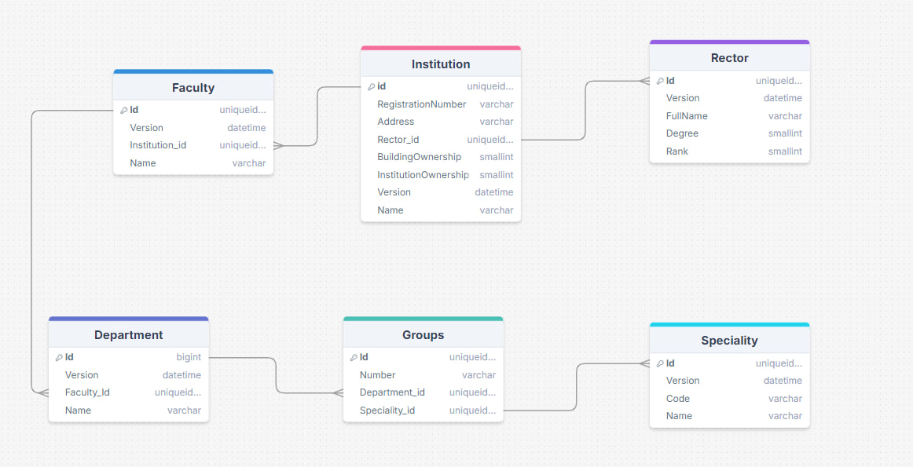

# Информация о Высших Учебных Заведения города

## Описание
В данном проекте хранится информация обо всех высших учебных заведениях (ВУЗах) города. Включает следующие данные:

- **Регистрационный номер**
- **Название**
- **Адрес**
- **Сведения о ректоре:**
  - ФИО
  - Степень
  - Звание
  - Должность
- **Собственность учреждения:**
  - Муниципальная
  - Частная
- **Собственность зданий:**
  - Федеральная
  - Муниципальная
  - Частная

Каждый ВУЗ также хранит информацию о факультетах, кафедрах и количестве групп по специальностям. Специальности характеризуются шифром и названием и могут быть общими для разных вузов.

## Запросы LINQ

### 1. Вывести информацию о выбранном вузе.

### 2. Вывести информацию о факультетах, кафедрах и специальностях данного вуза.

### 3. Вывести информацию о топ 5 популярных специальностях (с максимальным количеством групп).

### 4. Вывести информацию о ВУЗах с максимальным количеством кафедр, упорядочить по названию.

### 5. Вывести информацию о ВУЗах с заданной собственностью учреждения и количество групп в ВУЗе.

### 6. Вывести информацию о количестве факультетов, кафедр, специальностей по каждому типу собственности учреждения и собственности здания.

## Структура базы данных

