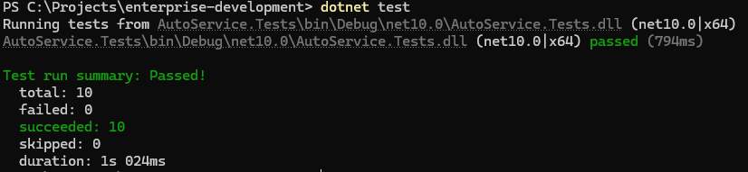

# Разработка корпоративных приложений — лабораторная работа №1

## «Классы»

В рамках первой лабораторной работы реализована объектно-ориентированная модель **автосервиса**, подготовлены тестовые данные и unit-тесты с использованием LINQ.

Данные хранятся **в памяти в виде коллекций**. Для генерации тестовых данных используется библиотека **Bogus**.

Вариант: 57

---

## Предметная область

Проект моделирует работу автомобильного сервиса.

### Основные сущности

| Класс | Назначение |
|---|---|
| `Client` | Клиент автосервиса |
| `Car` | Автомобиль клиента |
| `Mechanic` | Механик автосервиса |
| `WorkType` | Вид выполняемой работы |
| `RepairOrder` | Заказ на ремонт |
| `OrderWork` | Работа, включённая в заказ |
| `OrderMechanic` | Связь заказа с механиком |

### Перечисления

`MechanicSpecialization` — специализация механика:

- `Engine`
- `Transmission`
- `Electrical`
- `Diagnostics`
- `BodyRepair`

`WorkCategory` — категория работы:

- `Engine`
- `Transmission`
- `Electrical`
- `Diagnostics`
- `BodyRepair`
- `Maintenance`

---

## Связи между сущностями

Основные связи предметной области:

```text
Client
 └── Car
      └── RepairOrder
           ├── OrderWork ─── WorkType
           └── OrderMechanic ─── Mechanic
```

- один `Client` может иметь несколько автомобилей;
- один `Car` может иметь несколько заказов на ремонт;
- `RepairOrder` связан с клиентом и автомобилем;
- заказ содержит выполняемые работы через `OrderWork`;
- заказ связан с механиками через `OrderMechanic`.

---

## Данные и DataSeeder

Класс `AutoServiceContext` содержит коллекции:

```csharp
public List<Client> Clients { get; set; } = [];
public List<Car> Cars { get; set; } = [];
public List<Mechanic> Mechanics { get; set; } = [];
public List<WorkType> WorkTypes { get; set; } = [];
public List<RepairOrder> RepairOrders { get; set; } = [];
```

Начальное заполнение выполняется методом:

```csharp
DataSeeder.Seed()
```

В датасете создаются:

- 10 клиентов;
- 10 автомобилей;
- 10 механиков;
- 10 видов работ;
- 20 заказов на ремонт.

---

## Unit-тесты

Тесты находятся в проекте `AutoService.Tests`.

Для повторного использования одного набора данных используется `AutoServiceFixture`. При создании fixture вызывается `DataSeeder.Seed()`, после чего полученный `AutoServiceContext` используется тестами.

### `DomainTests`

Тесты проверяют корректность созданного датасета и основных связей.

### `QueriesTests`

В тестах реализованы LINQ-запросы.

---

## Запуск тестов

```powershell
dotnet test
```

## Результаты
